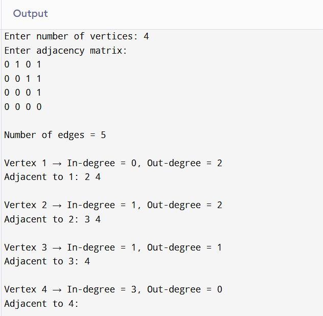
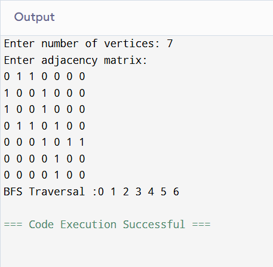
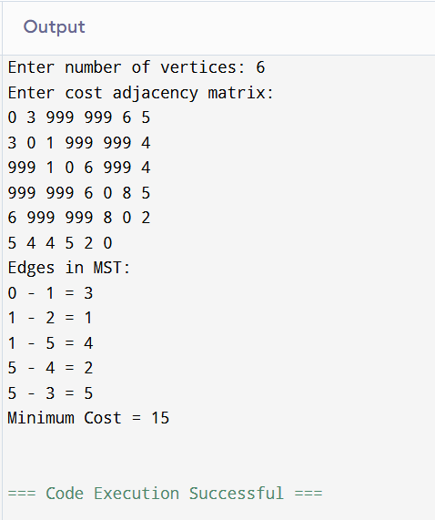
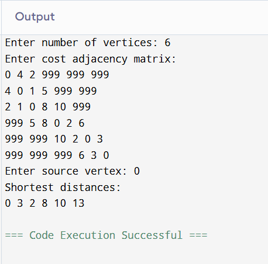

### Question 1
``` c
#include <stdio.h>

int main() {
    int n, i, j;
    printf("Enter number of vertices: ");
    scanf("%d", &n);

    int G[20][20];

    printf("Enter adjacency matrix:\n");
    for (i = 1; i <= n; i++) {
        for (j = 1; j <= n; j++) {
            scanf("%d", &G[i][j]);
        }
    }

    // Number of edges
    int edges = 0;
    for (i = 1; i <= n; i++)
        for (j = 1; j <= n; j++)
            if (G[i][j] == 1) edges++;

    printf("\nNumber of edges = %d\n", edges);

    // Degrees
    for (i = 1; i <= n; i++) {
        int indeg = 0, outdeg = 0;

        for (j = 1; j <= n; j++) {
            if (G[j][i] == 1) indeg++;
            if (G[i][j] == 1) outdeg++;
        }

        printf("\nVertex %d → In-degree = %d, Out-degree = %d\n", i, indeg, outdeg);

        printf("Adjacent to %d: ", i);
        for (j = 1; j <= n; j++)
            if (G[i][j] == 1) printf("%d ", j);
        printf("\n");
    }

    return 0;
}
```
### Output


### Question 2
``` c
#include <stdio.h>
#include <stdlib.h>

struct Node {
    int data;
    struct Node *next;
} *front=NULL, *rear=NULL;

void enqueue(int x){
    struct Node *t = (struct Node*)malloc(sizeof(struct Node));
    t->data = x;
    t->next = NULL;
    if(front == NULL)
        front = rear = t;
    else{
        rear->next = t;
        rear = t;
    }
}

int dequeue(){
    if(front == NULL) return -1;
    int x = front->data;
    struct Node *t = front;
    front = front->next;
    free(t);
    return x;
}

int isEmpty(){
    return front == NULL;
}

void BFS(int G[][20], int start, int n){
    int visited[20] = {0};
    printf("%d ", start);
    visited[start] = 1;
    enqueue(start);

    while(!isEmpty()){
        int u = dequeue();
        for(int v = 0; v < n; v++){
            if(G[u][v] == 1 && visited[v] == 0){
                printf("%d ", v);
                visited[v] = 1;
                enqueue(v);
            }
        }
    }
}

int main(){
    int n;
    printf("Enter number of vertices: ");
    scanf("%d", &n);

    int G[20][20];
    printf("Enter adjacency matrix:\n");
    for(int i=0;i<n;i++)
        for(int j=0;j<n;j++)
            scanf("%d",&G[i][j]);

    printf("BFS Traversal :");
    BFS(G, 0, n);
    return 0;
}
```
### Output


### Question 3
``` c
#include <stdio.h>

void DFS(int G[][20], int u, int n){
    static int visited[20];
    if(visited[u] == 0){
        printf("%d ", u);
        visited[u] = 1;

        for(int v=0; v<n; v++){
            if(G[u][v] == 1 && visited[v] == 0)
                DFS(G, v, n);
        }
    }
}

int main(){
    int n;
    printf("Enter number of vertices: ");
    scanf("%d",&n);

    int G[20][20];
    printf("Enter adjacency matrix:\n");
    for(int i=0;i<n;i++)
        for(int j=0;j<n;j++)
            scanf("%d",&G[i][j]);

    printf("DFS Traversal: ");
    DFS(G, 0, n);

    return 0;
}
```
### Output


### Question 4
``` c
#include <stdio.h>

int find(int u, int parent[]){
    while(parent[u] != u)
        u = parent[u];
    return u;
}

void Union(int u, int v, int parent[]){
    parent[v] = u;
}

int main(){
    int n;
    printf("Enter number of vertices: ");
    scanf("%d",&n);

    int cost[20][20];
    printf("Enter cost adjacency matrix:\n");
    for(int i=0;i<n;i++)
        for(int j=0;j<n;j++)
            scanf("%d",&cost[i][j]);

    int parent[20];
    for(int i=0;i<n;i++) parent[i] = i;

    int ne = 0, mincost = 0;

    printf("Edges in MST:\n");
    while(ne < n - 1){
        int min = 999, a=-1, b=-1;

        for(int i=0;i<n;i++)
            for(int j=0;j<n;j++)
                if(cost[i][j] < min && cost[i][j] != 0){
                    min = cost[i][j];
                    a = i; b = j;
                }

        int u = find(a, parent);
        int v = find(b, parent);

        if(u != v){
            printf("%d - %d = %d\n", a, b, min);
            mincost += min;
            Union(u, v, parent);
            ne++;
        }

        cost[a][b] = cost[b][a] = 999;
    }

    printf("Minimum Cost = %d\n", mincost);
    return 0;
}
```
### Output


### Question 5
``` c
#include <stdio.h>

int main(){
    int n;
    printf("Enter number of vertices: ");
    scanf("%d", &n);

    int cost[20][20];
    printf("Enter cost adjacency matrix:\n");
    for(int i=0;i<n;i++)
        for(int j=0;j<n;j++)
            scanf("%d",&cost[i][j]);

    int selected[20] = {0};
    selected[0] = 1;

    int ne = 0, mincost = 0;

    printf("Edges in MST:\n");
    while(ne < n-1){
        int min = 999, a = -1, b = -1;

        for(int i=0;i<n;i++){
            if(selected[i]){
                for(int j=0;j<n;j++){
                    if(!selected[j] && cost[i][j] < min){
                        min = cost[i][j];
                        a = i; b = j;
                    }
                }
            }
        }

        printf("%d - %d = %d\n", a, b, min);
        mincost += min;
        selected[b] = 1;
        ne++;
    }

    printf("Minimum Cost = %d\n", mincost);
    return 0;
}
```
### Output


### Question 6
``` c
#include <stdio.h>

int main(){
    int n, source;
    printf("Enter number of vertices: ");
    scanf("%d",&n);

    int cost[20][20];
    printf("Enter cost adjacency matrix:\n");
    for(int i=0;i<n;i++)
        for(int j=0;j<n;j++)
            scanf("%d",&cost[i][j]);

    printf("Enter source vertex: ");
    scanf("%d",&source);

    int dist[20], visited[20]={0};

    for(int i=0;i<n;i++)
        dist[i] = cost[source][i];

    visited[source] = 1;

    for(int count=1;count<n;count++){
        int min = 999, u=-1;

        for(int i=0;i<n;i++)
            if(!visited[i] && dist[i] < min){
                min = dist[i];
                u = i;
            }

        visited[u] = 1;

        for(int v=0;v<n;v++)
            if(!visited[v] && dist[u] + cost[u][v] < dist[v])
                dist[v] = dist[u] + cost[u][v];
    }

    printf("Shortest distances:\n");
    for(int i=0;i<n;i++)
        printf("%d ", dist[i]);

    return 0;
}
```
### Output

