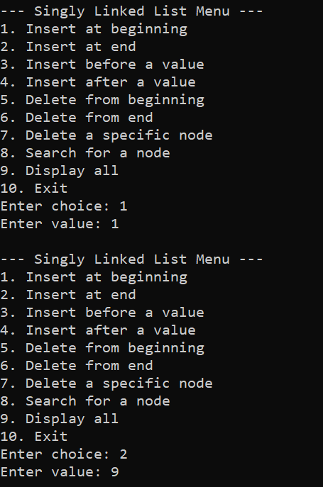
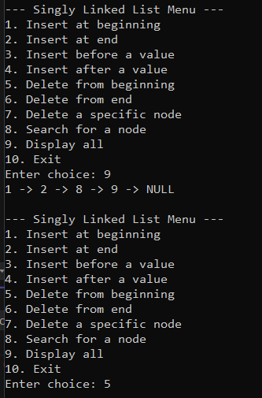
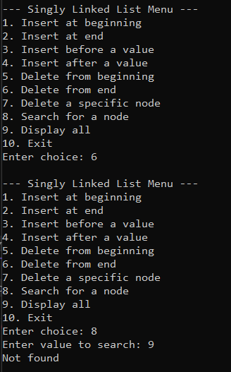
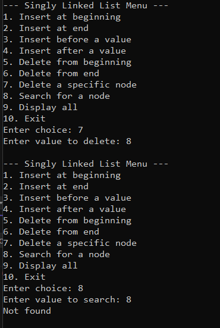
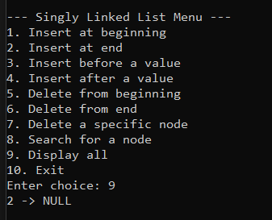
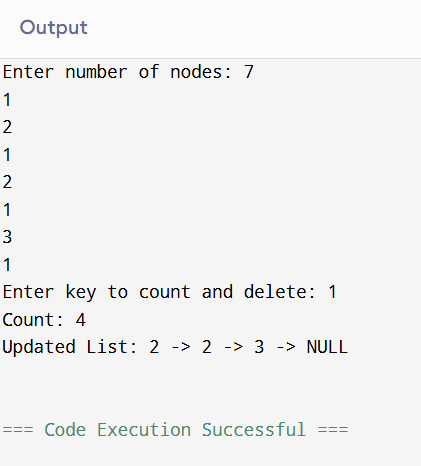
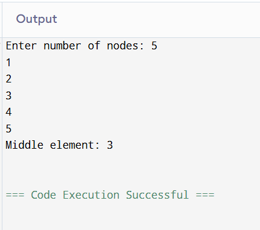
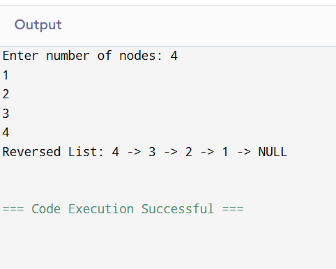

# Assignment 5

## Question 1:

### Code
```cpp
#include <iostream>
using namespace std;

struct Node {
    int data;
    Node* next;
};

int main() {
    Node* head = NULL;

    int choice, value, key, posChoice;
    while (true) {
        cout << "\n Singly Linked List Menu \n";
        cout << "1. Insert at beginning\n2. Insert at end\n3. Insert before a value\n4. Insert after a value\n";
        cout << "5. Delete from beginning\n6. Delete from end\n7. Delete a specific node\n";
        cout << "8. Search for a node\n9. Display all\n10. Exit\n";
        cout << "Enter choice: ";
        cin >> choice;

        if (choice == 1) { // insert at beginning
            cout << "Enter value: ";
            cin >> value;
            Node* newNode = new Node();
            newNode->data = value;
            newNode->next = head;
            head = newNode;
        }
        else if (choice == 2) { // insert at end
            cout << "Enter value: ";
            cin >> value;
            Node* newNode = new Node();
            newNode->data = value;
            newNode->next = NULL;
            if (head == NULL) head = newNode;
            else {
                Node* temp = head;
                while (temp->next != NULL) temp = temp->next;
                temp->next = newNode;
            }
        }
        else if (choice == 3 || choice == 4) { // insert before/after
            cout << "Enter key node value: ";
            cin >> key;
            cout << "Enter new value: ";
            cin >> value;

            Node* newNode = new Node();
            newNode->data = value;

            if (choice == 3) { // before key
                if (head == NULL) cout << "List empty\n";
                else if (head->data == key) { // before head
                    newNode->next = head;
                    head = newNode;
                }
                else {
                    Node* temp = head;
                    while (temp->next != NULL && temp->next->data != key)
                        temp = temp->next;
                    if (temp->next == NULL) cout << "Key not found\n";
                    else {
                        newNode->next = temp->next;
                        temp->next = newNode;
                    }
                }
            }
            else { // after key
                Node* temp = head;
                while (temp != NULL && temp->data != key)
                    temp = temp->next;
                if (temp == NULL) cout << "Key not found\n";
                else {
                    newNode->next = temp->next;
                    temp->next = newNode;
                }
            }
        }
        else if (choice == 5) { // delete from beginning
            if (head == NULL) cout << "List empty\n";
            else {
                Node* temp = head;
                head = head->next;
                delete temp;
            }
        }
        else if (choice == 6) { // delete from end
            if (head == NULL) cout << "List empty\n";
            else if (head->next == NULL) {
                delete head;
                head = NULL;
            }
            else {
                Node* temp = head;
                while (temp->next->next != NULL)
                    temp = temp->next;
                delete temp->next;
                temp->next = NULL;
            }
        }
        else if (choice == 7) { // delete specific
            cout << "Enter value to delete: ";
            cin >> key;
            if (head == NULL) cout << "List empty\n";
            else if (head->data == key) {
                Node* temp = head;
                head = head->next;
                delete temp;
            }
            else {
                Node* temp = head;
                while (temp->next != NULL && temp->next->data != key)
                    temp = temp->next;
                if (temp->next == NULL) cout << "Value not found\n";
                else {
                    Node* delNode = temp->next;
                    temp->next = delNode->next;
                    delete delNode;
                }
            }
        }
        else if (choice == 8) { // search node
            cout << "Enter value to search: ";
            cin >> key;
            int pos = 1;
            Node* temp = head;
            while (temp != NULL) {
                if (temp->data == key) {
                    cout << "Found at position " << pos << "\n";
                    break;
                }
                pos++;
                temp = temp->next;
            }
            if (temp == NULL) cout << "Not found\n";
        }
        else if (choice == 9) { // display
            Node* temp = head;
            while (temp != NULL) {
                cout << temp->data;
                temp = temp->next;
            }
            cout << "NULL\n";
        }
        else if (choice == 10) break;
        else cout << "Invalid choice\n";
    }

    return 0;
}

```
### Output







## Question 2:

### Code
```cpp
#include <iostream>
using namespace std;

struct Node {
    int data;
    Node* next;
};

int main() {
    Node* head = NULL;
    Node* tail = NULL;
    int n, x, key;

    cout << "Enter number of nodes: ";
    cin >> n;

    for (int i = 0; i < n; i++) {
        cin >> x;
        Node* newNode = new Node();
        newNode->data = x;
        newNode->next = NULL;
        if (head == NULL) head = tail = newNode;
        else {
            tail->next = newNode;
            tail = newNode;
        }
    }

    cout << "Enter key to count and delete: ";
    cin >> key;

    int count = 0;
    // Delete from start if key at head
    while (head != NULL && head->data == key) {
        Node* temp = head;
        head = head->next;
        delete temp;
        count++;
    }
    // Delete subsequent
    Node* curr = head;
    while (curr != NULL && curr->next != NULL) {
        if (curr->next->data == key) {
            Node* temp = curr->next;
            curr->next = temp->next;
            delete temp;
            count++;
        } else curr = curr->next;
    }

    cout << "Count: " << count << "\nUpdated List: ";
    Node* temp = head;
    while (temp != NULL) {
        cout << temp->data << " -> ";
        temp = temp->next;
    }
    cout << "NULL\n";
    return 0;
}
```
### Output


## Question 3

### Code
```cpp
#include <iostream>
using namespace std;

struct Node {
    int data;
    Node* next;
};

int main() {
    Node* head = NULL;
    Node* tail = NULL;
    int n, x;
    cout << "Enter number of nodes: ";
    cin >> n;
    for (int i = 0; i < n; i++) {
        cin >> x;
        Node* newNode = new Node();
        newNode->data = x;
        newNode->next = NULL;
        if (head == NULL) head = tail = newNode;
        else {
            tail->next = newNode;
            tail = newNode;
        }
    }

    Node* slow = head;
    Node* fast = head;
    while (fast != NULL && fast->next != NULL) {
        slow = slow->next;
        fast = fast->next->next;
    }
    cout << "Middle element: " << slow->data << "\n";
    return 0;
}
```
### Output


## Question 4

### Code
```cpp
#include <iostream>
using namespace std;

struct Node {
    int data;
    Node* next;
};

int main() {
    Node* head = NULL;
    Node* tail = NULL;
    int n, x;
    cout << "Enter number of nodes: ";
    cin >> n;
    for (int i = 0; i < n; i++) {
        cin >> x;
        Node* newNode = new Node();
        newNode->data = x;
        newNode->next = NULL;
        if (head == NULL) head = tail = newNode;
        else {
            tail->next = newNode;
            tail = newNode;
        }
    }

    Node* prev = NULL;
    Node* curr = head;
    Node* next = NULL;
    while (curr != NULL) {
        next = curr->next;
        curr->next = prev;
        prev = curr;
        curr = next;
    }
    head = prev;

    cout << "Reversed List: ";
    Node* temp = head;
    while (temp != NULL) {
        cout << temp->data << " -> ";
        temp = temp->next;
    }
    cout << "NULL\n";
    return 0;
}
```
### Output



