### Question 1(a) : Circular Linked List
```cpp
#include <iostream>
using namespace std;

struct Node {
    int data;
    Node* next;
};

int main() {
    Node* head = NULL;
    int choice, val, key;

    while (true) {
        cout << "\nCircular Linked List Menu\n";
        cout << "1.Insert at Beginning\n2.Insert at End\n3.Insert Before a Value\n4.Insert After a Value\n";
        cout << "5.Delete a Value\n6.Search\n7.Display\n8.Exit\n";
        cin >> choice;

        if (choice == 1) {  // insert at beginning
            cout << "Enter value: "; cin >> val;
            Node* newNode = new Node();
            newNode->data = val;

            if (head == NULL) {
                head = newNode;
                newNode->next = head;
            }
            else {
                Node* temp = head;
                while (temp->next != head) temp = temp->next;
                newNode->next = head;
                temp->next = newNode;
                head = newNode;
            }
        }

        else if (choice == 2) { // insert at end
            cout << "Enter value: "; cin >> val;
            Node* newNode = new Node();
            newNode->data = val;

            if (head == NULL) {
                head = newNode;
                newNode->next = head;
            }
            else {
                Node* temp = head;
                while (temp->next != head) temp = temp->next;
                temp->next = newNode;
                newNode->next = head;
            }
        }

        else if (choice == 3 || choice == 4) { // before/after
            cout << "Enter key value: "; cin >> key;
            cout << "Enter new value: "; cin >> val;
            Node* newNode = new Node();
            newNode->data = val;

            if (head == NULL) { cout << "List empty\n"; continue; }

            Node* temp = head;
            Node* prev = NULL;

            do {
                if (temp->data == key) break;
                prev = temp;
                temp = temp->next;
            } while (temp != head);

            if (temp->data != key) {
                cout << "Key not found\n";
                continue;
            }

            if (choice == 3) { // INSERT BEFORE key
                if (temp == head) {
                    // insert before head
                    Node* last = head;
                    while (last->next != head) last = last->next;
                    newNode->next = head;
                    last->next = newNode;
                    head = newNode;
                }
                else {
                    newNode->next = temp;
                    prev->next = newNode;
                }
            }
            else {  // INSERT AFTER key
                newNode->next = temp->next;
                temp->next = newNode;
            }
        }

        else if (choice == 5) { // delete
            cout << "Enter value to delete: "; cin >> key;

            if (head == NULL) { cout << "List empty\n"; continue; }

            Node* temp = head;
            Node* prev = NULL;

            // delete head case
            if (head->data == key) {
                // only one node
                if (head->next == head) {
                    delete head;
                    head = NULL;
                }
                else {
                    Node* last = head;
                    while (last->next != head) last = last->next;
                    last->next = head->next;
                    Node* del = head;
                    head = head->next;
                    delete del;
                }
            }
            else {
                do {
                    if (temp->data == key) break;
                    prev = temp;
                    temp = temp->next;
                } while (temp != head);

                if (temp->data != key) {
                    cout << "Value not found\n";
                }
                else {
                    prev->next = temp->next;
                    delete temp;
                }
            }
        }

        else if (choice == 6) { // search
            cout << "Enter value: "; cin >> key;
            if (head == NULL) { cout << "List empty\n"; continue; }

            Node* temp = head;
            int pos = 1;
            bool found = false;
            do {
                if (temp->data == key) {
                    cout << "Found at position " << pos << "\n";
                    found = true;
                    break;
                }
                temp = temp->next;
                pos++;
            } while (temp != head);

            if (!found) cout << "Not found\n";
        }

        else if (choice == 7) { // display
            if (head == NULL) { cout << "List empty\n"; continue; }
            Node* temp = head;
            do {
                cout << temp->data << " ";
                temp = temp->next;
            } while (temp != head);
            cout << endl;
        }

        else if (choice == 8) break;

        else cout << "Invalid choice\n";
    }

    return 0;
}
```
### Output


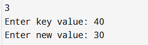
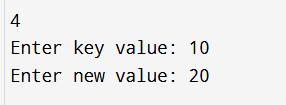
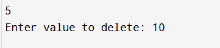
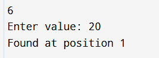
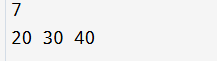

### Question 1(b) : Doubly Linked List
``` cpp
#include <iostream>
using namespace std;

struct Node {
    int data;
    Node* prev;
    Node* next;
};

int main() {
    Node* head = NULL;
    Node* tail = NULL;

    int choice, val, key;

    while (true) {
        cout << "\n Doubly Linked List Menu \n";
        cout << "1. Insert at Beginning\n2. Insert at End\n3. Insert Before a Value\n4. Insert After a Value\n";
        cout << "5. Delete a Value\n6. Search\n7. Display\n8. Exit\n";
        cout << "Enter choice: ";
        cin >> choice;

        // INSERT AT BEGINNING
        if (choice == 1) {
            cout << "Enter value: ";
            cin >> val;

            Node* newNode = new Node();
            newNode->data = val;
            newNode->prev = NULL;
            newNode->next = head;

            if (head != NULL) head->prev = newNode;
            else tail = newNode;  // list was empty

            head = newNode;
        }

        // INSERT AT END
        else if (choice == 2) {
            cout << "Enter value: ";
            cin >> val;

            Node* newNode = new Node();
            newNode->data = val;
            newNode->next = NULL;
            newNode->prev = tail;

            if (tail != NULL) tail->next = newNode;
            else head = newNode;

            tail = newNode;
        }

        // INSERT BEFORE or AFTER
        else if (choice == 3 || choice == 4) {
            cout << "Enter key value: ";
            cin >> key;
            cout << "Enter new value: ";
            cin >> val;

            if (head == NULL) {
                cout << "List empty\n";
                continue;
            }

            Node* temp = head;
            while (temp != NULL && temp->data != key)
                temp = temp->next;

            if (temp == NULL) {
                cout << "Key not found\n";
                continue;
            }

            Node* newNode = new Node();
            newNode->data = val;

            // INSERT BEFORE
            if (choice == 3) {
                newNode->next = temp;
                newNode->prev = temp->prev;

                if (temp->prev != NULL)
                    temp->prev->next = newNode;
                else
                    head = newNode;

                temp->prev = newNode;
            }

            // INSERT AFTER
            else {
                newNode->prev = temp;
                newNode->next = temp->next;

                if (temp->next != NULL)
                    temp->next->prev = newNode;
                else
                    tail = newNode;

                temp->next = newNode;
            }
        }

        // DELETE A VALUE
        else if (choice == 5) {
            cout << "Enter value to delete: ";
            cin >> key;

            if (head == NULL) {
                cout << "List empty\n";
                continue;
            }

            Node* temp = head;
            while (temp != NULL && temp->data != key)
                temp = temp->next;

            if (temp == NULL) {
                cout << "Value not found\n";
                continue;
            }

            // CASE 1: delete head
            if (temp == head) {
                head = head->next;
                if (head != NULL) head->prev = NULL;
                else tail = NULL;  // list empty now
            }

            // CASE 2: delete tail
            else if (temp == tail) {
                tail = tail->prev;
                tail->next = NULL;
            }

            // CASE 3: delete middle node
            else {
                temp->prev->next = temp->next;
                temp->next->prev = temp->prev;
            }

            delete temp;
            cout << "Node deleted\n";
        }

        // SEARCH
        else if (choice == 6) {
            cout << "Enter value to search: ";
            cin >> key;

            Node* temp = head;
            int pos = 1;
            bool found = false;

            while (temp != NULL) {
                if (temp->data == key) {
                    cout << "Found at position " << pos << "\n";
                    found = true;
                    break;
                }
                temp = temp->next;
                pos++;
            }

            if (!found) cout << "Not found\n";
        }

        // DISPLAY
        else if (choice == 7) {
            if (head == NULL) {
                cout << "List empty\n";
                continue;
            }

            cout << "List: ";
            Node* temp = head;
            while (temp != NULL) {
                cout << temp->data << " ";
                temp = temp->next;
            }
            cout << endl;
        }

        else if (choice == 8) break;

        else cout << "Invalid choice\n";
    }

    return 0;
}
```
### Output
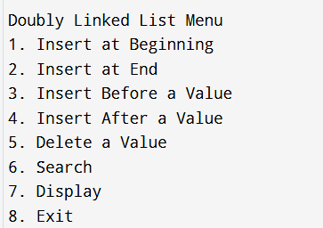
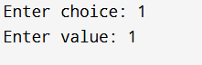
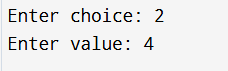
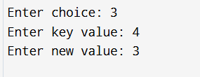
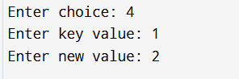
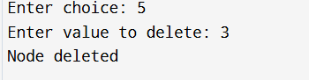
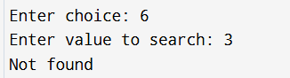


### Question 2
``` cpp
#include <iostream>
using namespace std;

struct Node {
    int data;
    Node* next;
};

int main() {
    Node* head = NULL;
    Node* tail = NULL;

    int n, x;
    cout << "Enter number of nodes: ";
    cin >> n;

    for (int i = 1; i <= n; i++) {
        cin >> x;
        Node* newNode = new Node();
        newNode->data = x;

        if (head == NULL) {
            head = newNode;
            tail = newNode;
            tail->next = head;
        } else {
            tail->next = newNode;
            newNode->next = head;
            tail = newNode;
        }
    }

    if (head == NULL) {
        cout << "List empty\n";
        return 0;
    }

    Node* temp = head;
    do {
        cout << temp->data << " ";
        temp = temp->next;
    } while (temp != head);

    cout << head->data;   // repeat head at end

    return 0;
}
```
### Output
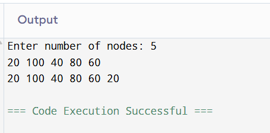

### Question 3(a)
``` cpp
#include <iostream>
using namespace std;

struct Node {
    int data;
    Node* prev;
    Node* next;
};

int main() {
    Node* head = NULL;
    Node* tail = NULL;

    int n, x;
    cout << "Enter number of nodes: ";
    cin >> n;

    for (int i = 0; i < n; i++) {
        cin >> x;
        Node* newNode = new Node();
        newNode->data = x;
        newNode->prev = tail;
        newNode->next = NULL;

        if (tail != NULL) tail->next = newNode;
        else head = newNode;

        tail = newNode;
    }

    int size = 0;
    Node* temp = head;
    while (temp != NULL) {
        size++;
        temp = temp->next;
    }

    cout << "Size of DLL = " << size;
    return 0;
}
```
### Output
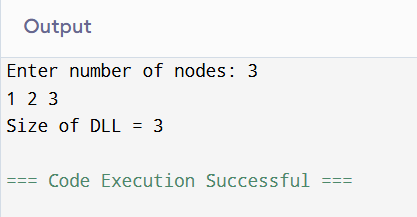

### Question 3(b)
``` cpp
#include <iostream>
using namespace std;

struct Node {
    int data;
    Node* next;
};

int main() {
    Node* head = NULL;
    Node* tail = NULL;

    int n, x;
    cout << "Enter number of nodes: ";
    cin >> n;

    for (int i = 0; i < n; i++) {
        cin >> x;
        Node* newNode = new Node();
        newNode->data = x;

        if (head == NULL) {
            head = newNode;
            tail = newNode;
            tail->next = head;
        } else {
            tail->next = newNode;
            newNode->next = head;
            tail = newNode;
        }
    }

    if (head == NULL) {
        cout << "Size of CLL = 0";
        return 0;
    }

    int size = 0;
    Node* temp = head;

    do {
        size++;
        temp = temp->next;
    } while (temp != head);

    cout << "Size of CLL = " << size;
    return 0;
}
```
### Output


### Question 4
``` cpp
#include <iostream>
#include <string>
using namespace std;

struct Node {
    char data;
    Node* prev;
    Node* next;
};

int main() {
    Node* head = NULL;
    Node* tail = NULL;

    string s;
    cout << "Enter string: ";
    cin >> s;

    // Create DLL
    for (int i = 0; i < s.length(); i++) {
        Node* newNode = new Node();
        newNode->data = s[i];
        newNode->next = NULL;
        newNode->prev = tail;

        if (tail != NULL) tail->next = newNode;
        else head = newNode; // first node

        tail = newNode;
    }

    // Check palindrome using two pointers
    Node* left = head;
    Node* right = tail;

    bool isPalindrome = true;

    while (left != NULL && right != NULL && left != right && left->prev != right) {
        if (left->data != right->data) {
            isPalindrome = false;
            break;
        }
        left = left->next;
        right = right->prev;
    }

    if (isPalindrome) cout << "Palindrome";
    else cout << "Not Palindrome";

    return 0;
}
```
### Output
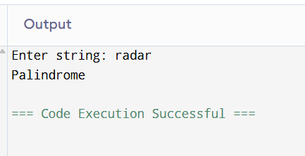

### Question 5
``` cpp
#include <iostream>
using namespace std;

struct Node {
    int data;
    Node* next;
};

int main() {
    Node* head = NULL;
    Node* tail = NULL;

    int n, x;
    cout << "Enter number of nodes: ";
    cin >> n;

    // Create a normal linear linked list first
    for (int i = 0; i < n; i++) {
        cin >> x;

        Node* newNode = new Node();
        newNode->data = x;
        newNode->next = NULL;

        if (head == NULL) {
            head = newNode;
            tail = newNode;
        } else {
            tail->next = newNode;
            tail = newNode;
        }
    }

    
     tail->next = head;  // make the list circular manually

    
    Node* slow = head;
    Node* fast = head;

    bool circular = false;

    while (fast != NULL && fast->next != NULL) {
        slow = slow->next;             // move slow by 1
        fast = fast->next->next;       // move fast by 2

        if (slow == fast) {            // cycle found
            circular = true;
            break;
        }
    }

    if (circular)
        cout << "Circular Linked List";
    else
        cout << "NOT Circular";

    return 0;
}
```
### Output
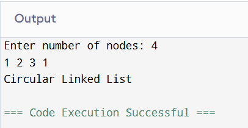


