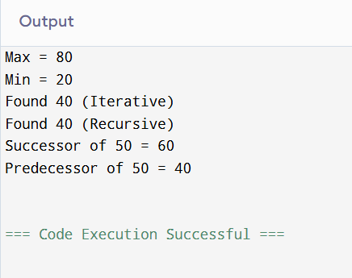

### Question 1
``` cpp
#include <iostream>
using namespace std;

struct Node {
    int data;
    Node* lchild;
    Node* rchild;
};

void Preorder(Node* p) {
    if (p != NULL) {
        cout << p->data << " ";
        Preorder(p->lchild);
        Preorder(p->rchild);
    }
}

void Inorder(Node* p) {
    if (p != NULL) {
        Inorder(p->lchild);
        cout << p->data << " ";
        Inorder(p->rchild);
    }
}

void Postorder(Node* p) {
    if (p != NULL) {
        Postorder(p->lchild);
        Postorder(p->rchild);
        cout << p->data << " ";
    }
}

int main() {
    
    Node* root = new Node{10, NULL, NULL};
    root->lchild = new Node{20, NULL, NULL};
    root->rchild = new Node{30, NULL, NULL};
    root->lchild->lchild = new Node{40, NULL, NULL};

    cout << "Preorder: ";
    Preorder(root);
    cout << "\n";

    cout << "Inorder: ";
    Inorder(root);
    cout << "\n";

    cout << "Postorder: ";
    Postorder(root);
    cout << "\n";

    return 0;
}
```
### Output


### Question 2
``` cpp
#include <iostream>
using namespace std;

struct Node {
    int data;
    Node* lchild;
    Node* rchild;
};

Node* RInsert(Node* p, int key) {
    if (p == NULL) {
        Node* t = new Node;
        t->data = key;
        t->lchild = t->rchild = NULL;
        return t;
    }
    if (key < p->data)
        p->lchild = RInsert(p->lchild, key);
    else if (key > p->data)
        p->rchild = RInsert(p->rchild, key);
    return p;
}


Node* Search(Node* p, int key) {
    while (p != NULL) {
        if (key == p->data)
            return p;
        else if (key < p->data)
            p = p->lchild;
        else
            p = p->rchild;
    }
    return NULL;
}


Node* RSearch(Node* p, int key) {
    if (p == NULL) return NULL;
    if (key == p->data) return p;
    else if (key < p->data) return RSearch(p->lchild, key);
    else return RSearch(p->rchild, key);
}


int Max(Node* p) {
    if (p == NULL) return -1;
    while (p->rchild != NULL)
        p = p->rchild;
    return p->data;
}


int Min(Node* p) {
    if (p == NULL) return -1;
    while (p->lchild != NULL)
        p = p->lchild;
    return p->data;
}


Node* InorderSuccessor(Node* p) {
    p = p->rchild;
    while (p != NULL && p->lchild != NULL)
        p = p->lchild;
    return p;
}

Node* InorderPredecessor(Node* p) {
    p = p->lchild;
    while (p != NULL && p->rchild != NULL)
        p = p->rchild;
    return p;
}


int main() {
    Node* root = NULL;
    int a[] = {50, 30, 70, 20, 40, 60, 80};
    for (int i = 0; i < 7; i++)
        root = RInsert(root, a[i]);

    cout << "Max = " << Max(root) << endl;
    cout << "Min = " << Min(root) << endl;

    Node* f = Search(root, 40);
    if (f) cout << "Found 40 (Iterative)\n";
    f = RSearch(root, 40);
    if (f) cout << "Found 40 (Recursive)\n";

    Node* suc = InorderSuccessor(RSearch(root, 50));
    cout << "Successor of 50 = " << suc->data << endl;

    Node* pre = InorderPredecessor(RSearch(root, 50));
    cout << "Predecessor of 50 = " << pre->data << endl;

    return 0;
}
```
### Output


### Question 3
``` cpp
#include <iostream>
using namespace std;

struct Node {
    int data;
    Node* lchild;
    Node* rchild;
};


Node* RInsert(Node* p, int key) {
    if (p == NULL) {
        Node* t = new Node;
        t->data = key;
        t->lchild = t->rchild = NULL;
        return t;
    }
    if (key < p->data)
        p->lchild = RInsert(p->lchild, key);
    else if (key > p->data)
        p->rchild = RInsert(p->rchild, key);
    return p;
}


int Height(Node* p) {
    if (p == NULL) return 0;
    int x = Height(p->lchild);
    int y = Height(p->rchild);
    return (x > y ? x + 1 : y + 1);
}


Node* InorderPredecessor(Node* p) {
    p = p->lchild;
    while (p->rchild != NULL)
        p = p->rchild;
    return p;
}


Node* InorderSuccessor(Node* p) {
    p = p->rchild;
    while (p->lchild != NULL)
        p = p->lchild;
    return p;
}


Node* Delete(Node* p, int key) {
    if (p == NULL) return NULL;

    if (key < p->data)
        p->lchild = Delete(p->lchild, key);
    else if (key > p->data)
        p->rchild = Delete(p->rchild, key);
    else {
        if (p->lchild == NULL && p->rchild == NULL) {
            delete p;
            return NULL;
        }

        if (Height(p->lchild) > Height(p->rchild)) {
            Node* q = InorderPredecessor(p);
            p->data = q->data;
            p->lchild = Delete(p->lchild, q->data);
        } else {
            Node* q = InorderSuccessor(p);
            p->data = q->data;
            p->rchild = Delete(p->rchild, q->data);
        }
    }
    return p;
}


int MaxDepth(Node* p) {
    if (p == NULL) return 0;
    int x = MaxDepth(p->lchild);
    int y = MaxDepth(p->rchild);
    return (x > y ? x + 1 : y + 1);
}


int MinDepth(Node* p) {
    if (p == NULL) return 0;
    int x = MinDepth(p->lchild);
    int y = MinDepth(p->rchild);
    return (x < y ? x + 1 : y + 1);
}


int main() {
    Node* root = NULL;

    int a[] = {50, 30, 20, 40, 70, 60, 80};
    for (int i = 0; i < 7; i++)
        root = RInsert(root, a[i]);

    cout << "Max Depth = " << MaxDepth(root) << endl;
    cout << "Min Depth = " << MinDepth(root) << endl;

    root = Delete(root, 20);
    root = Delete(root, 30);
    root = Delete(root, 50);

    cout << "Max Depth After Deletions = " << MaxDepth(root) << endl;

    return 0;
}
```
### Output


### Question 4
``` cpp
#include <iostream>
using namespace std;

struct Node {
    int data;
    Node* lchild;
    Node* rchild;
};


Node* Insert(Node* p, int key) {
    if (p == NULL) {
        Node* t = new Node;
        t->data = key;
        t->lchild = t->rchild = NULL;
        return t;
    }
    if (key < p->data)
        p->lchild = Insert(p->lchild, key);
    else
        p->rchild = Insert(p->rchild, key);
    return p;
}

int prevValue = -1000000;

bool isBST(Node* p) {
    if (p == NULL) return true;

    if (!isBST(p->lchild))
        return false;

    if (p->data <= prevValue)
        return false;

    prevValue = p->data;

    return isBST(p->rchild);
}

int main() {
    Node* root = NULL;

    
    int a[] = {10, 5, 1, 7, 40, 50};
    for (int i = 0; i < 6; i++)
        root = Insert(root, a[i]);

    if (isBST(root))
        cout << "This is a BST";
    else
        cout << "Not a BST";

    return 0;
}
```
### Output

